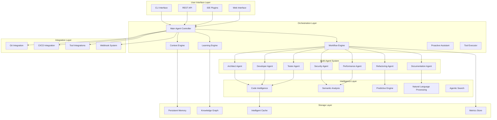

# Advanced AI Agent Features Design Document

## Overview

This design document outlines the architecture and implementation approach for transforming CodeGenie into a state-of-the-art AI coding agent with advanced autonomous capabilities, multi-agent coordination, adaptive learning, comprehensive development workflow automation, and Claude Code-like features.

The design focuses on creating a modular, extensible system that provides:
- **Autonomous multi-step task execution** with planning, execution, result checking, and iteration
- **Deep codebase awareness** with agentic search that automatically gathers relevant context
- **Comprehensive tool use** including terminal commands, file editing, REPL interaction, and git operations
- **Proactive behavior** that notices issues and suggests improvements unprompted
- **Terminal and IDE integration** for seamless developer experience

The system maintains the existing CodeGenie architecture while adding powerful new capabilities that rival and exceed leading AI development tools.

## Architecture

### High-Level Architecture



### Core Components

#### 1. Autonomous Workflow Engine

**Purpose**: Orchestrates complex multi-step development tasks with minimal human intervention, executing plans, checking results, and iterating based on outcomes.

**Key Features**:
- Hierarchical task decomposition with dependency management
- **Parallel execution** of independent tasks for optimal performance
- **Result verification** after each step with automatic iteration
- Dynamic replanning based on execution results and feedback
- Risk assessment and rollback capabilities with checkpoint-based recovery
- Real-time progress tracking and user intervention points
- Integration with all specialized agents and tool executor

**Architecture**:
```python
class WorkflowEngine:
    def __init__(self):
        self.task_planner = TaskPlanner()
        self.execution_engine = ExecutionEngine()
        self.result_verifier = ResultVerifier()
        self.parallel_executor = ParallelExecutor()
        self.risk_assessor = RiskAssessor()
        self.rollback_manager = RollbackManager()
        self.progress_tracker = ProgressTracker()
        self.tool_executor = ToolExecutor()
    
    async def execute_autonomous_workflow(self, goal: str, context: Dict) -> WorkflowResult
    async def create_execution_plan(self, goal: str) -> ExecutionPlan
    async def execute_step(self, step: WorkflowStep) -> StepResult
    async def verify_step_result(self, step: WorkflowStep, result: StepResult) -> VerificationResult
    async def iterate_on_failure(self, step: WorkflowStep, failure: Failure) -> RevisedStep
    async def execute_parallel_tasks(self, tasks: List[Task]) -> List[TaskResult]
    async def monitor_execution(self, plan: ExecutionPlan) -> None
    async def handle_intervention(self, intervention: UserIntervention) -> None
```

#### 2. Multi-Agent Coordination System

**Purpose**: Coordinates specialized AI agents for different aspects of development work.

**Agent Specializations**:
- **Architect Agent**: System design, architecture decisions, technology selection
- **Developer Agent**: Code implementation, debugging, feature development
- **Tester Agent**: Test creation, test strategy, quality assurance
- **Security Agent**: Vulnerability scanning, security best practices, threat modeling
- **Performance Agent**: Performance analysis, optimization, profiling
- **Documentation Agent**: Documentation generation, maintenance, quality
- **Refactoring Agent**: Code quality improvement, structural optimization

**Coordination Architecture**:
```python
class MultiAgentSystem:
    def __init__(self):
        self.agents = {
            'architect': ArchitectAgent(),
            'developer': DeveloperAgent(),
            'tester': TesterAgent(),
            'security': SecurityAgent(),
            'performance': PerformanceAgent(),
            'documentation': DocumentationAgent(),
            'refactoring': RefactoringAgent()
        }
        self.coordinator = AgentCoordinator()
        self.communication_bus = AgentCommunicationBus()
        self.conflict_resolver = ConflictResolver()
    
    async def delegate_task(self, task: Task) -> List[AgentAssignment]
    async def coordinate_execution(self, assignments: List[AgentAssignment]) -> CoordinationResult
    async def resolve_conflicts(self, conflicts: List[AgentConflict]) -> Resolution
```

#### 3. Advanced Code Intelligence

**Purpose**: Provides deep semantic understanding of code structure, patterns, and relationships.

**Capabilities**:
- Abstract Syntax Tree (AST) analysis with semantic enrichment
- Cross-language dependency tracking
- Design pattern recognition and analysis
- Code smell and anti-pattern detection
- Impact analysis for proposed changes
- Knowledge graph construction and maintenance

**Implementation**:
```python
class CodeIntelligence:
    def __init__(self):
        self.ast_analyzer = ASTAnalyzer()
        self.semantic_analyzer = SemanticAnalyzer()
        self.pattern_recognizer = PatternRecognizer()
        self.dependency_tracker = DependencyTracker()
        self.knowledge_graph = CodeKnowledgeGraph()
    
    async def analyze_codebase(self, project_path: Path) -> CodebaseAnalysis
    async def analyze_semantic_relationships(self, files: List[Path]) -> SemanticGraph
    async def detect_patterns_and_smells(self, code: str) -> PatternAnalysis
    async def predict_change_impact(self, change: CodeChange) -> ImpactAnalysis
```

#### 4. Adaptive Learning Engine

**Purpose**: Learns from user interactions, feedback, and coding patterns to provide personalized assistance.

**Learning Mechanisms**:
- User preference modeling through interaction analysis
- Coding style pattern recognition and adaptation
- Feedback loop integration for continuous improvement
- Success rate tracking for different suggestion types
- Personalized recommendation generation

**Architecture**:
```python
class LearningEngine:
    def __init__(self):
        self.preference_modeler = UserPreferenceModeler()
        self.pattern_learner = CodingPatternLearner()
        self.feedback_processor = FeedbackProcessor()
        self.recommendation_engine = PersonalizedRecommendationEngine()
        self.privacy_manager = PrivacyManager()
    
    async def learn_from_interaction(self, interaction: UserInteraction) -> None
    async def update_user_profile(self, feedback: UserFeedback) -> None
    async def generate_personalized_suggestions(self, context: Context) -> List[Suggestion]
    async def adapt_agent_behavior(self, user_profile: UserProfile) -> AgentConfiguration
```

#### 5. Context Engine with Agentic Search

**Purpose**: Maintains comprehensive project and conversation context across sessions with automatic context gathering capabilities.

**Context Management**:
- **Agentic search** that automatically gathers relevant files and symbols without manual selection
- Automatic codebase scanning and indexing for comprehensive understanding
- Persistent conversation history with semantic indexing
- Project evolution tracking and milestone recognition
- Long-term goal and decision tracking
- Intelligent context summarization and prioritization
- Semantic search across historical interactions and codebase

**Implementation**:
```python
class ContextEngine:
    def __init__(self):
        self.memory_manager = PersistentMemoryManager()
        self.context_summarizer = ContextSummarizer()
        self.semantic_indexer = SemanticIndexer()
        self.evolution_tracker = ProjectEvolutionTracker()
        self.search_engine = SemanticSearchEngine()
        self.agentic_search = AgenticSearchEngine()
        self.codebase_scanner = CodebaseScanner()
    
    async def store_interaction(self, interaction: Interaction) -> None
    async def retrieve_relevant_context(self, query: str) -> ContextBundle
    async def perform_agentic_search(self, intent: str, context: Dict) -> SearchResult
    async def auto_gather_context(self, task: Task) -> GatheredContext
    async def scan_and_index_codebase(self, project_path: Path) -> IndexResult
    async def summarize_session_history(self, session_id: str) -> SessionSummary
    async def track_project_evolution(self, changes: List[Change]) -> EvolutionInsight
```

#### 6. Tool Executor and Environment Interaction

**Purpose**: Provides comprehensive tool use capabilities including command execution, file editing, REPL interaction, and version control operations.

**Key Capabilities**:
- **Terminal command execution** with output capture and error handling
- **Iterative command execution** - run command, check result, fix issues, retry
- **REPL interaction** for testing code snippets in real-time
- **File editing** with precise line-level modifications and multi-file coordination
- **Git operations** including commits, branches, and merge conflict resolution
- **IDE integration** for navigation, symbol lookup, and debugging
- **Result verification** and automatic corrective actions

**Architecture**:
```python
class ToolExecutor:
    def __init__(self):
        self.terminal_executor = TerminalExecutor()
        self.file_editor = FileEditor()
        self.repl_manager = REPLManager()
        self.git_integration = GitIntegration()
        self.ide_bridge = IDEBridge()
        self.result_analyzer = ResultAnalyzer()
    
    async def execute_command(self, command: str, cwd: Path) -> CommandResult
    async def execute_with_retry(self, command: str, max_retries: int) -> CommandResult
    async def analyze_command_output(self, output: str, errors: str) -> OutputAnalysis
    async def fix_and_retry(self, command: str, error: CommandError) -> CommandResult
    async def interact_with_repl(self, code: str, language: str) -> REPLResult
    async def edit_file(self, file_path: Path, edits: List[FileEdit]) -> EditResult
    async def edit_multiple_files(self, edits: Dict[Path, List[FileEdit]]) -> MultiEditResult
    async def create_commit(self, message: str, files: List[Path]) -> CommitResult
    async def manage_branch(self, operation: BranchOperation) -> BranchResult
    async def resolve_merge_conflict(self, conflict: MergeConflict) -> Resolution

class TerminalExecutor:
    async def run_command(self, command: str, cwd: Path, env: Dict) -> ProcessResult
    async def capture_output(self, process: Process) -> Tuple[str, str, int]
    async def stream_output(self, process: Process, callback: Callable) -> None
    async def kill_process(self, process: Process) -> None

class REPLManager:
    async def start_repl(self, language: str) -> REPLSession
    async def execute_in_repl(self, session: REPLSession, code: str) -> REPLOutput
    async def get_repl_state(self, session: REPLSession) -> REPLState
    async def close_repl(self, session: REPLSession) -> None
```

#### 7. Proactive Assistant

**Purpose**: Continuously monitors the codebase and proactively suggests improvements, identifies issues, and anticipates developer needs without explicit prompts.

**Proactive Behaviors**:
- **Continuous monitoring** of codebase for issues and inconsistencies
- **Related code identification** - finds code that needs updates when working on a feature
- **Convention enforcement** - notices and suggests fixes for pattern violations
- **Security and performance alerts** - proactively identifies vulnerabilities and bottlenecks
- **Next step suggestions** - anticipates logical next steps in development workflow
- **Pattern learning** - learns from codebase to anticipate common needs

**Architecture**:
```python
class ProactiveAssistant:
    def __init__(self):
        self.codebase_monitor = CodebaseMonitor()
        self.pattern_analyzer = PatternAnalyzer()
        self.issue_detector = IssueDetector()
        self.suggestion_engine = SuggestionEngine()
        self.workflow_predictor = WorkflowPredictor()
    
    async def monitor_codebase(self, project_path: Path) -> MonitoringResult
    async def identify_related_code(self, current_work: WorkContext) -> RelatedCode
    async def detect_convention_violations(self, code: str) -> List[Violation]
    async def scan_for_issues(self, scope: CodeScope) -> List[Issue]
    async def suggest_proactive_improvements(self, context: Context) -> List[Suggestion]
    async def predict_next_steps(self, current_state: ProjectState) -> List[NextStep]
    async def learn_codebase_patterns(self, project_path: Path) -> PatternKnowledge

class CodebaseMonitor:
    async def watch_for_changes(self, project_path: Path) -> ChangeStream
    async def analyze_change_impact(self, change: Change) -> ImpactAnalysis
    async def identify_affected_areas(self, change: Change) -> List[CodeArea]
    async def suggest_related_updates(self, change: Change) -> List[Update]
```

## Components and Interfaces

### 1. Autonomous Workflow Components

#### WorkflowPlanner
```python
class WorkflowPlanner:
    async def create_plan(self, goal: str, context: Context) -> WorkflowPlan
    async def decompose_task(self, task: Task) -> List[Subtask]
    async def identify_dependencies(self, tasks: List[Task]) -> DependencyGraph
    async def estimate_effort(self, plan: WorkflowPlan) -> EffortEstimate
    async def assess_risks(self, plan: WorkflowPlan) -> RiskAssessment
```

#### ExecutionEngine
```python
class ExecutionEngine:
    async def execute_plan(self, plan: WorkflowPlan) -> ExecutionResult
    async def execute_task(self, task: Task, context: Context) -> TaskResult
    async def handle_task_failure(self, task: Task, error: Exception) -> RecoveryAction
    async def create_checkpoint(self, execution_state: ExecutionState) -> Checkpoint
    async def rollback_to_checkpoint(self, checkpoint: Checkpoint) -> RollbackResult
```

### 2. Multi-Agent System Interfaces

#### BaseAgent
```python
class BaseAgent:
    def __init__(self, name: str, capabilities: List[str]):
        self.name = name
        self.capabilities = capabilities
        self.model_router = ModelRouter()
        self.context = AgentContext()
    
    async def can_handle_task(self, task: Task) -> bool
    async def execute_task(self, task: Task) -> AgentResult
    async def collaborate_with(self, other_agent: 'BaseAgent', task: Task) -> CollaborationResult
    async def provide_expertise(self, question: str) -> ExpertiseResponse
```

#### SpecializedAgents
```python
class ArchitectAgent(BaseAgent):
    async def design_system_architecture(self, requirements: Requirements) -> Architecture
    async def select_technologies(self, constraints: Constraints) -> TechnologyStack
    async def create_design_patterns(self, context: Context) -> DesignPatterns
    async def review_architecture(self, existing_arch: Architecture) -> ArchitectureReview

class SecurityAgent(BaseAgent):
    async def scan_for_vulnerabilities(self, code: str) -> VulnerabilityReport
    async def suggest_security_fixes(self, vulnerabilities: List[Vulnerability]) -> List[SecurityFix]
    async def perform_threat_modeling(self, architecture: Architecture) -> ThreatModel
    async def validate_security_fixes(self, fixes: List[SecurityFix]) -> ValidationResult
```

### 3. Code Intelligence Interfaces

#### SemanticAnalyzer
```python
class SemanticAnalyzer:
    async def analyze_code_semantics(self, code: str, language: str) -> SemanticAnalysis
    async def extract_entities(self, code: str) -> List[CodeEntity]
    async def identify_relationships(self, entities: List[CodeEntity]) -> RelationshipGraph
    async def detect_patterns(self, code: str) -> List[DesignPattern]
    async def assess_complexity(self, code: str) -> ComplexityMetrics
```

#### KnowledgeGraph
```python
class CodeKnowledgeGraph:
    async def add_code_entity(self, entity: CodeEntity) -> None
    async def add_relationship(self, relationship: CodeRelationship) -> None
    async def query_relationships(self, entity: CodeEntity) -> List[CodeRelationship]
    async def find_similar_patterns(self, pattern: CodePattern) -> List[SimilarPattern]
    async def get_impact_analysis(self, change: CodeChange) -> ImpactAnalysis
```

## Data Models

### Core Data Structures

```python
@dataclass
class WorkflowPlan:
    id: str
    goal: str
    tasks: List[Task]
    dependencies: DependencyGraph
    parallel_groups: List[List[Task]]  # Tasks that can run in parallel
    estimated_duration: timedelta
    risk_level: RiskLevel
    checkpoints: List[Checkpoint]
    rollback_strategy: RollbackStrategy
    verification_steps: List[VerificationStep]

@dataclass
class Task:
    id: str
    description: str
    type: TaskType
    assigned_agent: str
    dependencies: List[str]
    estimated_effort: int
    success_criteria: List[str]
    verification_method: VerificationMethod
    rollback_plan: Optional[str]
    tool_requirements: List[ToolRequirement]
    can_run_parallel: bool

@dataclass
class CommandResult:
    command: str
    exit_code: int
    stdout: str
    stderr: str
    duration: float
    success: bool
    analysis: Optional[OutputAnalysis]
    suggested_fixes: List[str]

@dataclass
class FileEdit:
    file_path: Path
    edit_type: EditType  # insert, delete, replace, create, move
    line_start: Optional[int]
    line_end: Optional[int]
    content: str
    reason: str

@dataclass
class AgenticSearchResult:
    query: str
    relevant_files: List[Path]
    relevant_symbols: List[Symbol]
    context_summary: str
    confidence: float
    search_strategy: str
    gathered_context: Dict[str, Any]

@dataclass
class ProactiveSuggestion:
    type: SuggestionType  # improvement, fix, refactor, test, documentation
    severity: Severity  # info, warning, error, critical
    title: str
    description: str
    affected_files: List[Path]
    suggested_action: str
    code_snippet: Optional[str]
    reasoning: str
    confidence: float

@dataclass
class AgentResult:
    agent_name: str
    task_id: str
    success: bool
    output: Any
    confidence: float
    reasoning: str
    suggestions: List[str]
    next_steps: List[str]

@dataclass
class CodeEntity:
    id: str
    name: str
    type: EntityType  # function, class, module, variable, etc.
    location: CodeLocation
    signature: Optional[str]
    documentation: Optional[str]
    complexity_metrics: ComplexityMetrics
    relationships: List[str]

@dataclass
class UserProfile:
    user_id: str
    coding_style: CodingStyle
    preferences: Dict[str, Any]
    skill_level: SkillLevel
    favorite_patterns: List[str]
    feedback_history: List[Feedback]
    learning_goals: List[str]
```

### Context and Memory Models

```python
@dataclass
class ContextBundle:
    conversation_history: List[Interaction]
    project_state: ProjectState
    user_goals: List[Goal]
    recent_changes: List[Change]
    relevant_knowledge: List[KnowledgeItem]
    priority_score: float

@dataclass
class ProjectEvolution:
    project_id: str
    timeline: List[Milestone]
    architecture_changes: List[ArchitectureChange]
    technology_adoption: List[TechnologyChange]
    quality_trends: QualityTrends
    team_patterns: TeamPatterns
```

## Error Handling

### Comprehensive Error Management

```python
class AdvancedErrorHandler:
    def __init__(self):
        self.error_classifier = ErrorClassifier()
        self.recovery_strategies = RecoveryStrategies()
        self.learning_engine = ErrorLearningEngine()
    
    async def handle_workflow_error(self, error: WorkflowError) -> RecoveryAction
    async def handle_agent_error(self, error: AgentError) -> AgentRecovery
    async def handle_integration_error(self, error: IntegrationError) -> IntegrationRecovery
    async def learn_from_error(self, error: Exception, context: Context) -> None

class ErrorRecoveryStrategies:
    async def retry_with_backoff(self, operation: Callable) -> Any
    async def fallback_to_simpler_approach(self, task: Task) -> Task
    async def request_human_intervention(self, error: ComplexError) -> InterventionRequest
    async def rollback_and_replan(self, checkpoint: Checkpoint) -> NewPlan
```

### Error Types and Handling

1. **Workflow Errors**: Task failures, dependency conflicts, resource constraints
2. **Agent Errors**: Model failures, capability mismatches, communication issues
3. **Integration Errors**: Tool failures, API limitations, network issues
4. **Context Errors**: Memory corruption, context overflow, inconsistent state
5. **Learning Errors**: Feedback conflicts, model degradation, bias detection

## Testing Strategy

### Multi-Level Testing Approach

#### 1. Unit Testing
- Individual component testing with comprehensive mocking
- Agent behavior testing with simulated scenarios
- Algorithm testing for code intelligence components
- Performance testing for critical paths

#### 2. Integration Testing
- Multi-agent coordination testing
- Workflow execution testing with real projects
- Context engine persistence testing
- Learning engine adaptation testing

#### 3. End-to-End Testing
- Complete autonomous workflow scenarios
- Real-world project integration testing
- Performance and scalability testing
- User experience and interface testing

#### 4. Specialized Testing

```python
class AutonomousWorkflowTester:
    async def test_workflow_execution(self, scenario: TestScenario) -> TestResult
    async def test_error_recovery(self, error_scenario: ErrorScenario) -> RecoveryResult
    async def test_rollback_mechanisms(self, rollback_scenario: RollbackScenario) -> RollbackResult

class MultiAgentTester:
    async def test_agent_coordination(self, coordination_scenario: CoordinationScenario) -> CoordinationResult
    async def test_conflict_resolution(self, conflict_scenario: ConflictScenario) -> ResolutionResult
    async def test_agent_specialization(self, specialization_test: SpecializationTest) -> SpecializationResult

class LearningEngineTester:
    async def test_preference_learning(self, learning_scenario: LearningScenario) -> LearningResult
    async def test_adaptation_accuracy(self, adaptation_test: AdaptationTest) -> AdaptationResult
    async def test_privacy_preservation(self, privacy_test: PrivacyTest) -> PrivacyResult
```

## Security Considerations

### Security Architecture

1. **Agent Isolation**: Each agent runs in isolated environments with limited permissions
2. **Code Execution Sandboxing**: All code execution happens in secure sandboxes
3. **Data Encryption**: All persistent data encrypted at rest and in transit
4. **Access Control**: Role-based access control for different functionality levels
5. **Audit Logging**: Comprehensive logging of all agent actions and decisions

### Security Implementation

```python
class SecurityManager:
    def __init__(self):
        self.sandbox_manager = SandboxManager()
        self.encryption_service = EncryptionService()
        self.access_controller = AccessController()
        self.audit_logger = AuditLogger()
    
    async def validate_agent_action(self, agent: str, action: Action) -> ValidationResult
    async def encrypt_sensitive_data(self, data: Any) -> EncryptedData
    async def audit_agent_decision(self, agent: str, decision: Decision) -> None
    async def check_permissions(self, user: User, resource: Resource) -> PermissionResult
```

## Performance Optimization

### Performance Architecture

1. **Intelligent Caching**: Multi-level caching for code analysis, model responses, and context
2. **Lazy Loading**: On-demand loading of heavy components and data
3. **Parallel Processing**: Concurrent execution of independent tasks and analyses
4. **Resource Management**: Dynamic resource allocation based on task complexity
5. **Model Optimization**: Efficient model selection and response caching

### Performance Implementation

```python
class PerformanceOptimizer:
    def __init__(self):
        self.cache_manager = IntelligentCacheManager()
        self.resource_manager = ResourceManager()
        self.parallel_executor = ParallelExecutor()
        self.model_optimizer = ModelOptimizer()
    
    async def optimize_workflow_execution(self, workflow: Workflow) -> OptimizedWorkflow
    async def cache_analysis_results(self, analysis: Analysis) -> None
    async def manage_resource_allocation(self, tasks: List[Task]) -> ResourceAllocation
    async def optimize_model_usage(self, requests: List[ModelRequest]) -> OptimizedRequests
```

## Terminal Integration

### Native Terminal Interface

**Purpose**: Provide a native terminal interface where developers can interact with CodeGenie using natural language commands, similar to Claude Code's terminal experience.

**Key Features**:
- Natural language command interpretation in terminal
- Direct command execution with real-time output streaming
- Interactive mode for multi-turn conversations
- Command history and context awareness
- Integration with shell environment and tools

**Architecture**:
```python
class TerminalInterface:
    def __init__(self):
        self.command_parser = NaturalLanguageCommandParser()
        self.terminal_executor = TerminalExecutor()
        self.context_manager = TerminalContextManager()
        self.output_formatter = TerminalOutputFormatter()
    
    async def process_natural_language_command(self, command: str) -> CommandResult
    async def execute_in_terminal(self, command: str) -> ExecutionResult
    async def stream_output_to_terminal(self, process: Process) -> None
    async def handle_interactive_session(self, session: TerminalSession) -> None
    async def integrate_with_shell(self, shell_type: str) -> ShellIntegration

class NaturalLanguageCommandParser:
    async def parse_intent(self, command: str) -> CommandIntent
    async def extract_parameters(self, command: str, intent: CommandIntent) -> Dict
    async def convert_to_executable(self, intent: CommandIntent, params: Dict) -> ExecutableCommand
```

## Integration Points

### External System Integration

1. **Terminal Integration**: Native terminal interface with natural language command support
2. **IDE Integration**: VS Code, IntelliJ, Vim plugins with real-time collaboration
3. **Version Control**: Deep Git integration with intelligent commit analysis and conflict resolution
4. **CI/CD Integration**: GitHub Actions, Jenkins, GitLab CI integration
5. **Project Management**: Jira, Trello, Asana integration for task tracking
6. **Communication**: Slack, Teams, Discord integration for team collaboration
7. **REPL Integration**: Python, Node.js, Ruby, and other language REPL support

### API Design

```python
class IntegrationAPI:
    # IDE Integration
    async def provide_code_suggestions(self, context: IDEContext) -> List[Suggestion]
    async def analyze_code_in_editor(self, code: str, cursor_position: int) -> Analysis
    
    # CI/CD Integration
    async def review_pull_request(self, pr: PullRequest) -> ReviewResult
    async def generate_deployment_plan(self, changes: List[Change]) -> DeploymentPlan
    
    # Team Integration
    async def share_knowledge(self, knowledge: Knowledge, team: Team) -> None
    async def coordinate_team_work(self, team_context: TeamContext) -> CoordinationPlan
```

This comprehensive design provides the foundation for implementing advanced AI coding agent features that will significantly enhance CodeGenie's capabilities while maintaining its existing architecture and ensuring seamless integration.